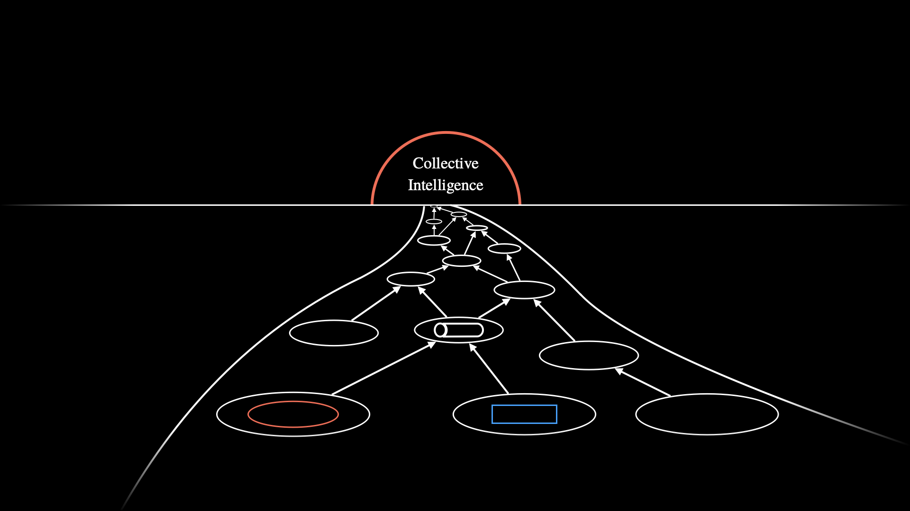

# CollectiveIntelligence

Collective intelligence refers to the phenomenon where a group of individuals, through their interactions, form a higher-level intelligence similar to how individual cells form an intelligent organism. Just as neurons combine to create a brain with emergent properties far greater than the sum of its parts, humans can form a super organism or collective intelligence by following the right protocols, enabling them to achieve large-scale change.